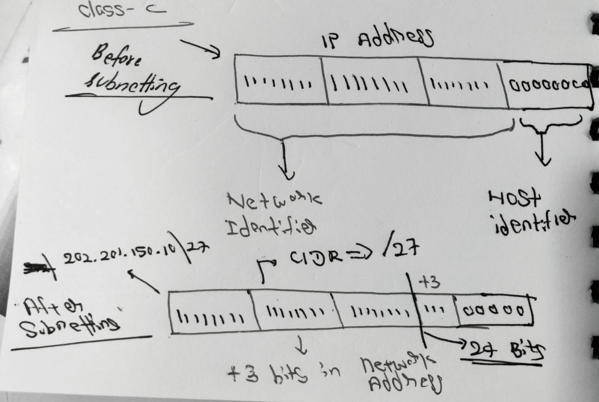

# Subnetting

### What is IP Address
An IP address (Internet protocol address) is a unique logical address assigned to devices on network for identification and communication.

#### IPv4
It a 32-bit system for IP Addresses, separated by periods. Each section is called an *octet*.
The number range for each octet is 0-255.

```text
192.168.1.0 (decimal format)
11000000.10101000.00000001.00000000 (binary format)
```

An IP address has two parts:
- Network Address: ID assigned to the network
- Host address: ID assigned to the host in the network.

  
## What is a Subnetting?
Subnetting is a technique used to split a large IP network into smaller subnetworks to improve network performance, security, and efficient IP address utilization.

## Subnet Mask
A subnet mask is a 32-bit number that identifies which part of an IP address represents the network and which part represents the host.

- The subnet mask uses 1s to represent the network portion and 0s to represent the host portion of an IP address.
- In classful Addressing, IPv4 are divided into 5 classes(A, B, C, D, and E) based on the number of bits used for the network    and host portion
  
eg:
```text
  Class C:
  
  11111111.11111111.11111111.00000000       
  |________________________| |______|
        Network bits         Host Bits

  Network Bits: 24
  Host bits: 8
  Total Address: 256
  Usable hosts: 254
```

```text
for class A: 255.0.0.0
class B: 255.255.0.0
class C: 255.255.255.0
```
why 255?
 - Because the network bits are denoted by 1s, and the maximum value, when all the bits in the octet are 1, is 255.

## CIDR Range
CIDR (Classless Inter Domain Routing) helps to know how many bits are available with the network identifier. For example, example:
```text
 11111111.11111111.11111111.00000000
|_________________________|
         24 bits
CIDR range: /24
```
Eg 2:
```text
11111111.11111110.00000000.00000000
|______________|
    15 Bits
CIDR range: /15
```

## Network ID
